<div align="center">

# LegacyGraph

**A self-hosted genealogy platform where the database is your file system.**

Plain YAML and Markdown on disk, versioned by Git, served by an in-memory graph runtime.

[](LICENSE)
[](https://nodejs.org)
[](#testing)

</div>

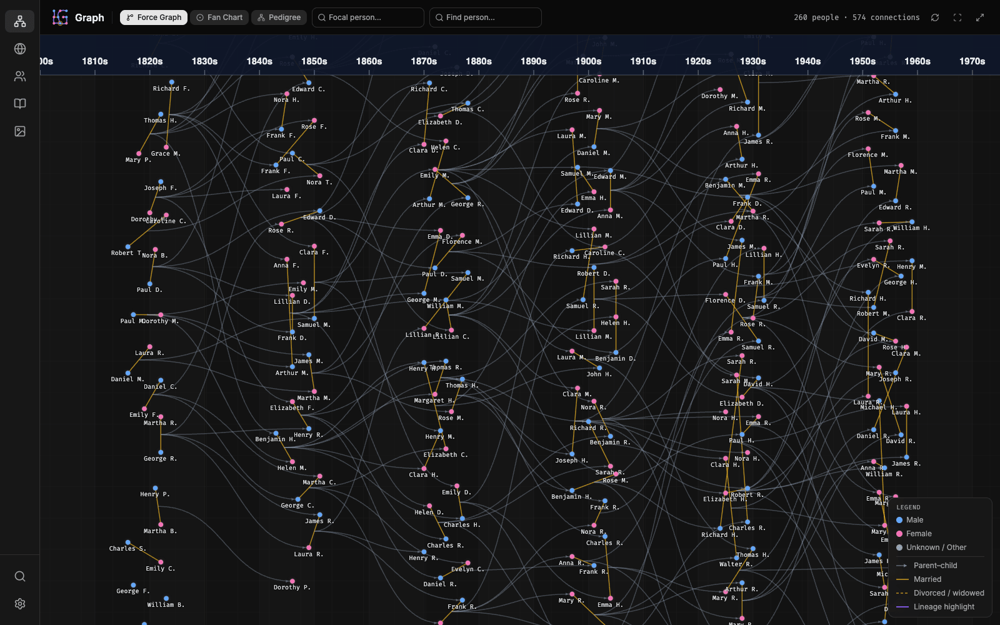

---

## Why

Most genealogy software locks decades of research inside a proprietary database. When the vendor
disappears, the research goes with it. LegacyGraph is built on the opposite bet:

1. **The Notepad Rule** — the database *is* the file system. Every person is a YAML file, every
   story a Markdown file. You can read, edit, `grep`, and diff your entire family history with
   nothing but a text editor. The app is an enhancer, not a gatekeeper.

2. **Git is the undo button** — every save is debounced into an atomic commit in your data
   directory. Your history has a history.

3. **Event-sourced truth** — only `relationships.parents[]` is ever stored. Spouses, children, and
   siblings are computed at runtime by replaying life events, so the data can never contradict
   itself.

4. **Local-first** — no cloud dependency, no account, no telemetry. Geocoding runs against a local
   GeoNames SQLite database and the map ships its own offline basemap, so none of your data ever
   leaves the machine. (The only outbound request is the webfont stylesheet in `client/index.html`;
   self-host those three families if you want a fully airgapped install.)

```yaml
# people/N_walter-hawthorne-1926-hartford-7x9az2kp.yaml
version: '5.1'
id: N_walter-hawthorne-1926-hartford-7x9az2kp
names:
  - primary: true
    first: Walter
    last: Hawthorne
sex: M
relationships:
  parents:                       # the ONLY stored relationship
    - id: N_benjamin-hawthorne-1897-providence-k2mq8vtt
      type: biological
events:
  - type: marriage               # spouses are derived from events, not stored
    date: 23 JUL 1952
    sort_date: '1952-07-23'
    partner_id: N_emily-reed-1925-boston-ld4vxn02
    status: married
    location:
      name: Burlington
      lat: 44.47588
      lng: -73.21207
      countryCode: US
```

---

## Screenshots

> All screenshots use a generated demo dataset — 260 synthetic people across six generations,
> 1816–2019. The photographs are procedurally generated placeholders.

### Person detail — the "Holy Grail" layout

Computed relationships on the left, an event timeline with gap indicators in the centre, and
assets / notebook / GEDCOM tabs on the right.

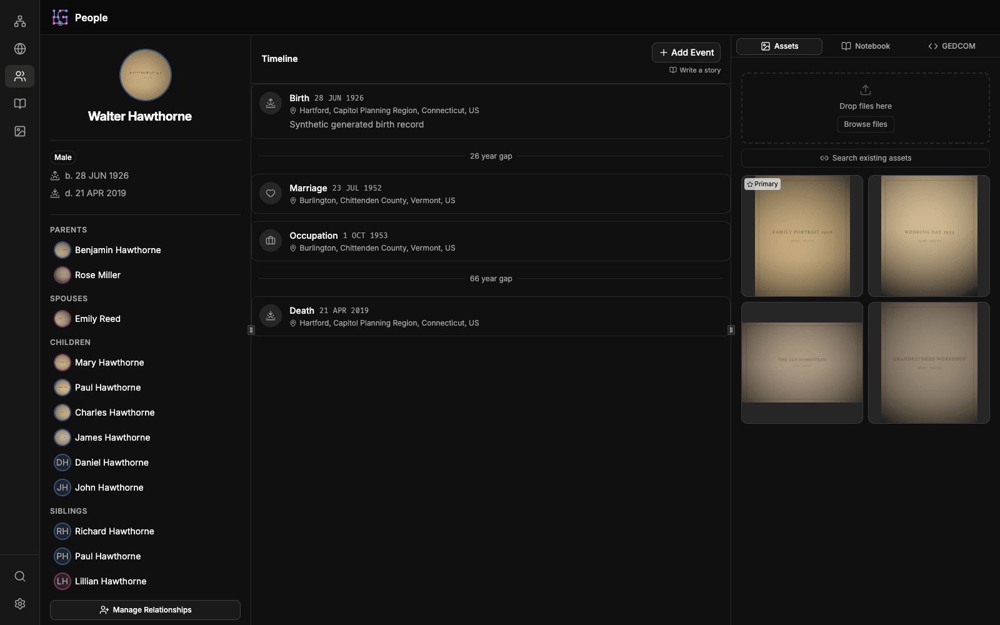

### Three ways to read a tree

<table>
<tr>
<td width="50%">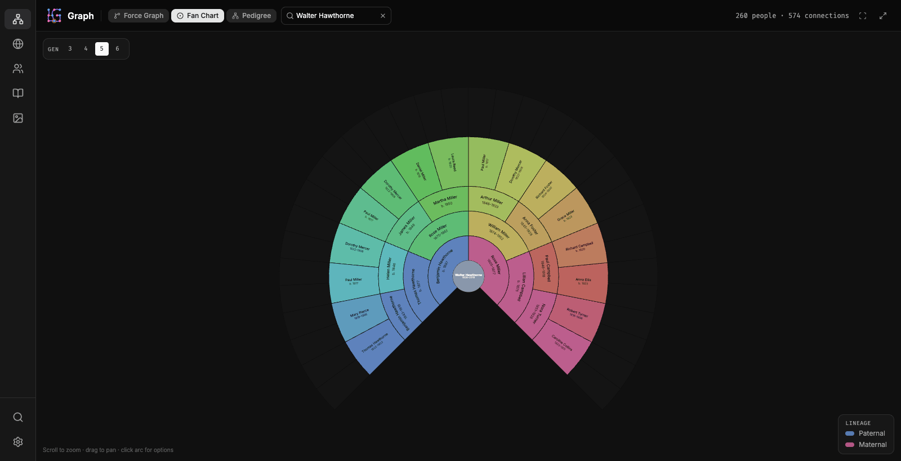</td>
<td width="50%">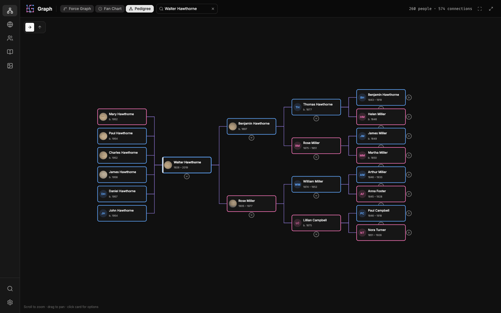</td>
</tr>
<tr>
<td><b>Fan chart</b> — 360° Ahnentafel with paternal/maternal lineage colouring, 3–6 generations deep.</td>
<td><b>Pedigree</b> — bidirectional Reingold–Tilford layout with progressive disclosure; descendants left, ancestors right.</td>
</tr>
</table>

The force graph on the hero image is the third mode: a Y-gravity layout that pins each person to
their birth decade, with sex-coloured nodes and marriage/parent edges.

### Map view

Every geocoded event on an offline basemap. Zooming crossfades between a heatmap, embers, and
individual pins; the dual-handle time slider scrubs and plays back the window, all filtered on the
GPU.

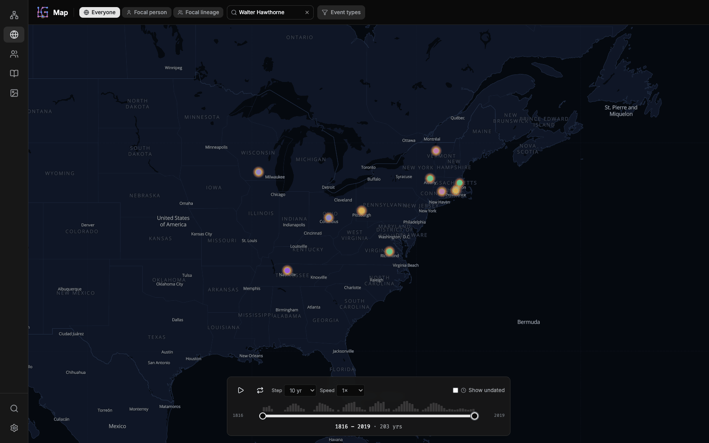

### Stories

Markdown files with YAML frontmatter. `@N_xxx` mentions become real graph edges, rendered as
person chips and surfaced on the profiles they reference.

<table>
<tr>
<td width="50%">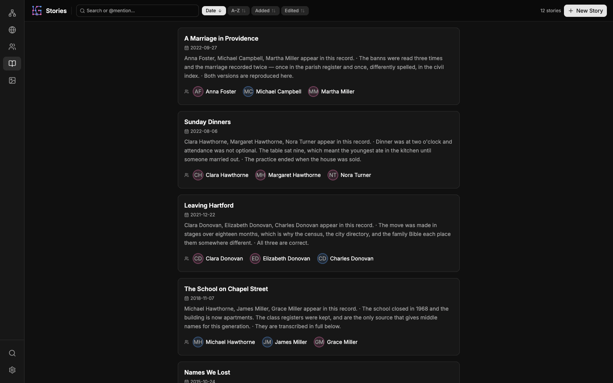</td>
<td width="50%">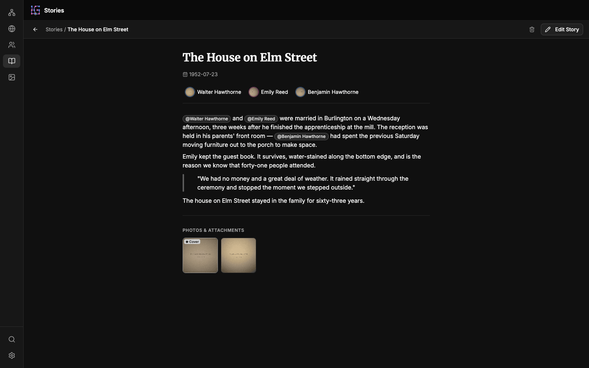</td>
</tr>
</table>

### Browse, search, and assets

<table>
<tr>
<td width="50%">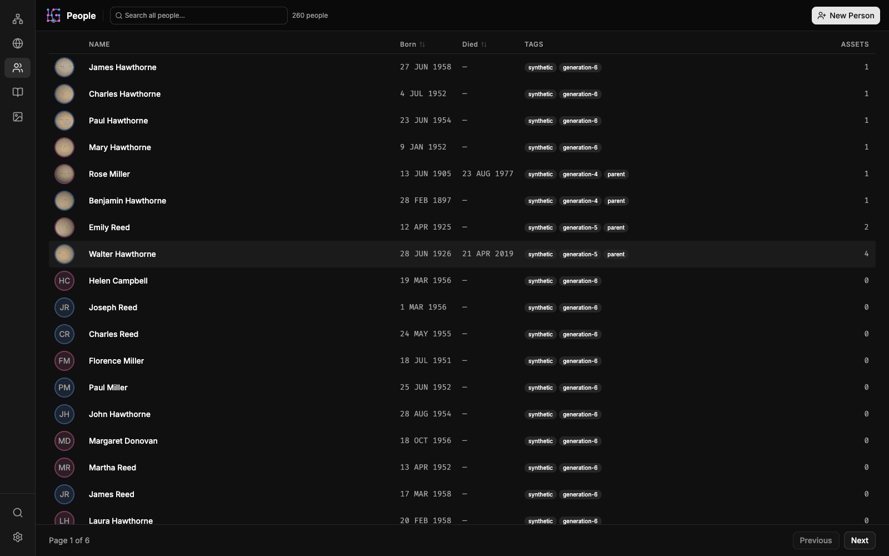</td>
<td width="50%">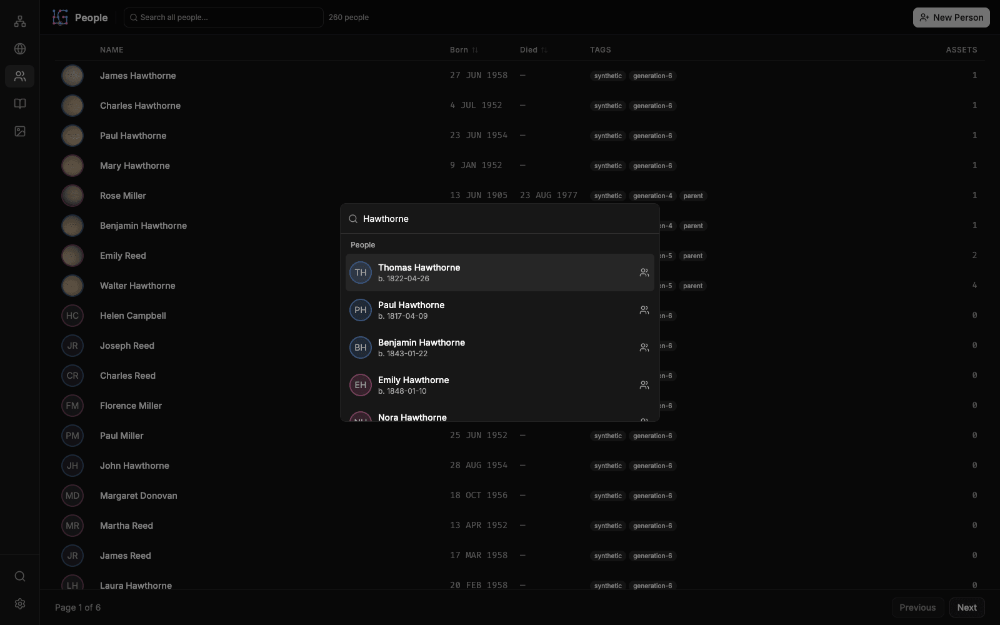</td>
</tr>
<tr>
<td><b>People</b> — virtualized, sortable, paginated.</td>
<td><b>Cmd+K</b> — server-side FlexSearch across people, stories, and places.</td>
</tr>
<tr>
<td width="50%">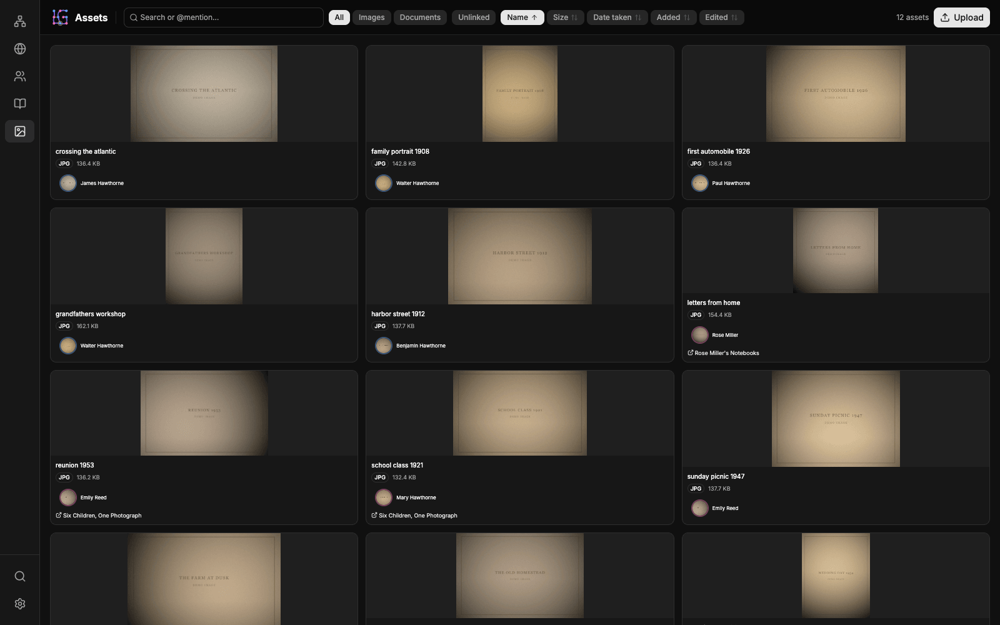</td>
<td width="50%">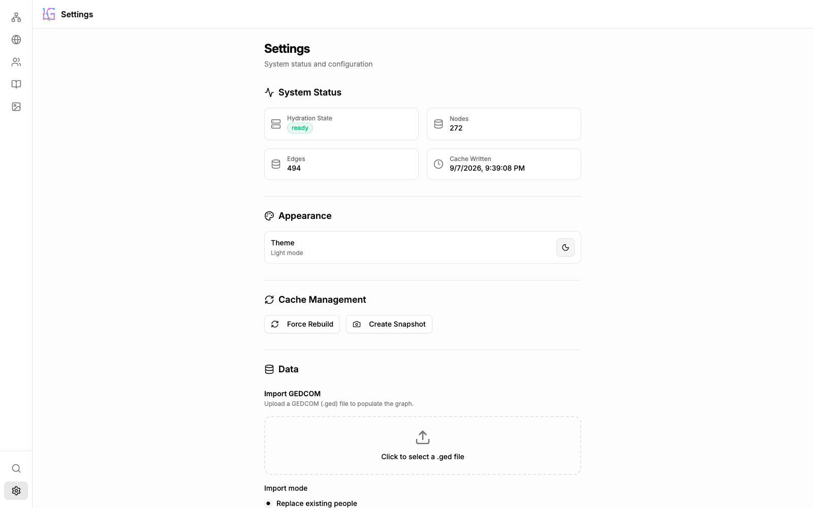</td>
</tr>
<tr>
<td><b>Assets</b> — every file in one grid, with orphan detection and backlinks to people and stories.</td>
<td><b>Settings</b> — system status, GEDCOM import, batch geocoding. Light and dark themes throughout.</td>
</tr>
</table>

---

## Getting started

### Requirements

- Node.js ≥ 22.12
- Git

### Install

```bash
git clone https://github.com/dylanwebster/legacy-graph.git
cd legacy-graph
npm install
cd client && npm install && cd ..
```

### Configure

Create a `.env` file in the repository root:

```bash
DATA_DIR=./data       # where your family history lives
PORT=3000
```

`DATA_DIR` is required — the server refuses to boot without it. Prepare the directory once:

```bash
mkdir -p data/{people,stories,assets}
git init data          # writes are committed here; without a repo, commits fail
```

Point `DATA_DIR` at an existing tree instead to load it as-is.

### Generate a demo dataset

To see the app populated before importing anything real:

```bash
npm run generate:synthetic-data -- --count 260 --generations 6 --stories 12 --output ./data
```

### Run

```bash
npm start                    # backend on :3000
cd client && npm run dev     # frontend on :5173, proxies /api → :3000
```

Open http://localhost:5173. The graph hydrates in a worker thread while the server stays
responsive; a progress overlay streams the boot over SSE, and the API returns `503` until the
graph is ready.

> **Note:** there is no production build target yet — the frontend runs on the Vite dev server.
> Docker and desktop packaging are on the [roadmap](PROGRESS.md).

### Import a GEDCOM

Settings → **Data** → *Import GEDCOM*. Unmapped GEDCOM tags are preserved verbatim under
`_gedcom` on each person, so nothing is silently dropped on the way in. Export is not yet
implemented.

---

## Optional: offline geocoding and maps

Place search, EXIF reverse-geocoding, and the map view all read from a local GeoNames database.
Without it the app runs fine — geocoding simply returns empty and locations stay as plain strings.

```bash
npm run geonames:build       # downloads ~580 MB, builds ~900 MB at ~/.legacy-graph/geonames.db
```

Override the location with `GEONAMES_DB=/path/to/geonames.db` in `.env`.

Once built, Settings → **Data** → *Scan Locations* batch-geocodes every location string in your
tree, scores each match by confidence, and lets you review and correct before applying. Original
strings are preserved under `_gedcom.original_locations`.

---

## Authentication

Auth is off by default — appropriate for a single user on `localhost`. To enable it, create
`$DATA_DIR/_meta/auth.yaml`:

```yaml
jwt_secret: "a-random-string-of-at-least-32-characters"
session_expiry: "24h"
users:
  - username: dylan
    password_hash: "$2b$10$..."   # bcrypt
```

The server detects the file on boot and guards every endpoint except `POST /api/auth/login`,
`GET /api/system/status`, and the hydration SSE stream. Sessions are JWTs in an HttpOnly cookie.

---

## Architecture

LegacyGraph runs a **dual-head** pattern: one head owns durability, the other owns speed.

```
┌─ Head 1: Persistence ────────┐        ┌─ Head 2: Runtime ──────────────┐
│  people/*.yaml               │        │  Fastify + Graphology          │
│  stories/*.md                │ ─────► │  in-memory multigraph          │
│  assets/*                    │ hydrate│  FlexSearch index              │
│  _meta/*.yaml                │        │  computed relationship cache   │
│  .git/                       │ ◄───── │                                │
└──────────────────────────────┘  write └────────────────────────────────┘
                                          ▲
                        @parcel/watcher ───┘  hot-patch on external edits
```

**Boot.** Hydration runs in a worker thread so the server never blocks. A tiered cache compares
per-file `mtime`s against `_meta/.graph-cache.json` and re-parses only what changed; the
FlexSearch index is imported from a serialized snapshot the same way. Heavy fields
(`scrapbook_md`, `_gedcom`) are stripped from the in-memory node and lazily re-read from disk on
detail requests — the *slim node* strategy that keeps ~100k people inside the default V8 heap.

**Live edits.** `@parcel/watcher` uses native OS APIs (FSEvents / `ReadDirectoryChangesW` /
inotify) to catch changes made outside the app. Edit a YAML file in your editor and the graph
hot-patches in under 100 ms, reconciling edges by diff rather than reloading.

**Writes.** Every write goes through a `TransactionManager` that debounces a 5-second window and
commits the burst atomically via `isomorphic-git` — in-process, no subprocess spawning. Commits
are currently labelled by subject (`"Update 1 file: Walter Hawthorne"`); operation-aware messages
(`"Add person: …"`, `"Import 47 people from …"`) are part of the Git history work below.

**Spouses.** Computed by the *Henry VIII algorithm*: replay every `marriage` and `divorce` event
in `sort_date` order and see who is left standing.

### Core modules

| Module | Responsibility |
|:---|:---|
| `GraphEngine` | Graph construction, hydration, file watching, hot-patching |
| `BootLoader` | YAML parsing and Zod validation |
| `GraphLogic` | Computed relationships (spouses, children, siblings) |
| `SearchService` | FlexSearch indexing and persistence |
| `TimelineSlicer` | Chronological event assembly with gap detection |
| `TransactionManager` | Debounced, semantically-messaged Git commits |
| `GeocodingService` / `GeonamesDb` | Offline forward and reverse geocoding |

### Stack

**Backend** — Fastify 5, Graphology, Zod 4, FlexSearch, isomorphic-git, Sharp, `read-gedcom`,
`@parcel/watcher`, `node:sqlite`.

**Frontend** — React 19, Vite, TypeScript 6, TanStack Router + Query, Zustand, shadcn/ui
(Radix + Tailwind v4), MapLibre + deck.gl, `react-force-graph-2d`, Milkdown Crepe.

### Layout

```
src/
  core/          GraphEngine, BootLoader, GraphLogic, SearchService, TimelineSlicer,
                 TransactionManager, GeocodingService, GeonamesDb, Thumbnailer,
                 StoryLoader, gedcom/
  api/routes/    people, stories, assets, search, system, auth, gedcom, geocoding, map
  schemas/       Person, Event, Story, Asset, Place, Auth
  server.ts      Fastify setup

client/src/
  routes/        TanStack file-based routes (thin; re-export from features/)
  features/      assets, dashboard, people, search, settings, stories, map
  shared/        api hooks, cross-feature components, lib, store, shadcn/ui primitives

tests/
  api/ core/ schemas/    Vitest
  e2e/                   Playwright
```

Full technical detail lives in [`SPECIFICATION.md`](SPECIFICATION.md), which is authoritative —
discrepancies between spec and code are treated as bugs.

---

## Testing

```bash
npm test                          # 624 backend unit tests
cd client && npm test             # 51 frontend unit tests
npm run test:e2e                  # 33 Playwright CUJ tests
npm run test:visual               # map basemap visual regression baselines
npm run lint                      # backend  (and: cd client && npm run lint)
npm run build                     # tsc --noEmit type check
```

E2E tests start their own backend on `:3000` against a fixture data directory — stop the dev
server first (`lsof -ti :3000 | xargs kill`).

Development is test-driven: a failing test comes before the implementation.

---

## Status

Everything shown above is implemented. Actively in progress:

- **Private / guest mode** — per-person `private` flag with unauthenticated filtering
- **Git history** — semantic commit messages, plus an in-app commit log and restore (single person
  or whole repo)
- **Distribution** — Docker image, Electron wrapper, GEDCOM export UI

See [`PROGRESS.md`](PROGRESS.md) for the full phase-by-phase status.

---

## License

[PolyForm Noncommercial License 1.0.0](LICENSE) — free to use, modify, and share for any
noncommercial purpose, including personal and family research. Commercial use requires a separate
license.
